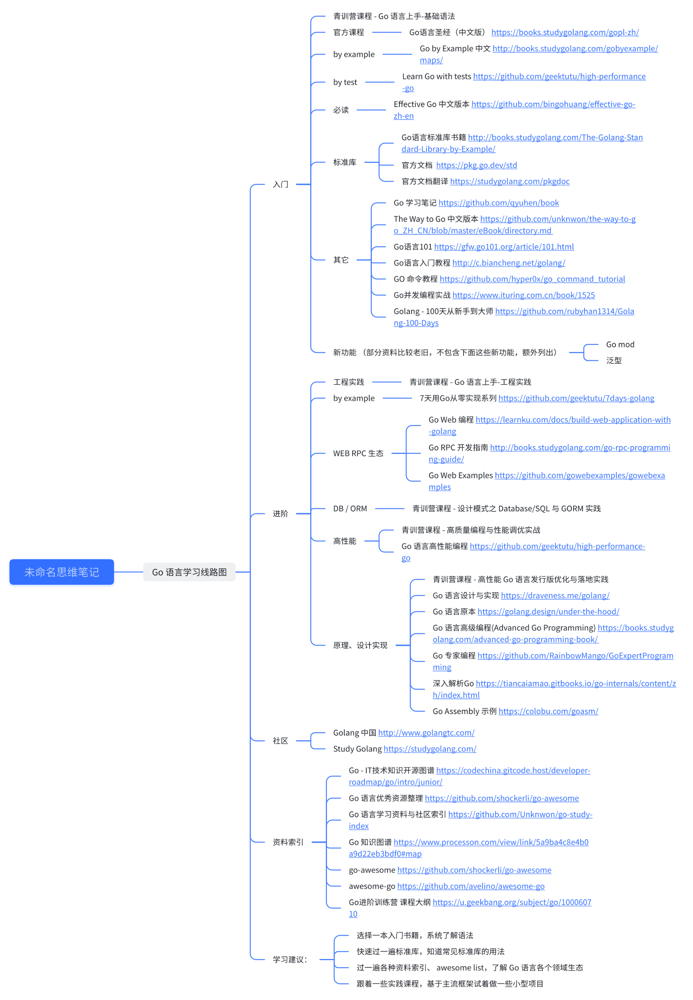

最开始接触编程语言是高中时的 VB ；为了打算竞又学了 C++ ，不过当时对 C++ 的掌握也就是 C with STL了；后来又跟着网络资料学了点现代 C++，但是发现制作 web 后端非常困难，缺少成熟的生态。当时师傅问了我一个问题，为什么 C++ 和 Java 都能做后端，为什么选 Java？

我当时还没想明白这个问题（开局不学爪哇导致的），后来出于学习 web 后端的目的，接触了 Go，才发现这就是 Java 那一套，然后我才发现，C++ 学 CMU15-445 这一套更适合做基础架构（当然基础好点更好啦），用来做 web 后端是在不太合适；在此后出于自己的爱好、工程的需要、面试的考察，以及在字节青训营的学习，对 Go 对认识开始深入起来。此时再去反思自己的 Go学习，感觉仍然有许多没有完全或者完整理解的地方，学习路径也存在一定问题。因此，我想要展开一次重新学习和整理。

## 学习路径
??? note "学习路径" 
    

## 学习资料
??? note "一些资料"    
    

## 内容安排
初步想的内容（划删除线的是可能延后的内容）：
（写好了的就打勾）

### 练手Demo

- [x] [Fyne图形化](https://github.com/Slumhee/Go001Fyne-01_gofynetutorials)
- [x] [Web点赞页面](https://github.com/Moonlight-Zhao/go-project-example)
- [x] [socket5代理](https://github.com/HughTaiyaki/go-by-example)
- [ ] [Go + Gin + Gorm + Vue3 + Redis + MySQL 快速上手](https://github.com/Slumhee/Web003Gin-01_gingormtutorials)
- [ ] [gomall](https://github.com/cloudwego/biz-demo/tree/main/gomall)

### 基础
- [ ] Go的基础语法
    * [ ] 数组 & 切片
    * [ ] 协程，管道，缓冲区，选择，互斥锁
    * [ ] Defer,Error,Panic,Recover
- [ ] Go的依赖管理
    * [ ] Go语义版本号，版号，脚本，存储库及其他特性
- [ ] sql操作

### 通用开发技能
- [ ] [http框架学习](https://github.com/cloudwego/hertz)
- [x] Git
- [x] 基本Authentication,OAuth,JWT等
- [x] SOLID,KISS,DRY 
- [x] [docker](https://wangchujiang.com/reference/docs/docker.html) 
- [x] [Makefile](https://hughtaiyaki.github.io/blog/Others/MakefileLearn/)
- [ ] k8s

### 建议了解的库
- [ ] Validator：数据验证
- [ ] Glow：分布式计算
- [ ] GJson：高效 JSON 解析
- [ ] Authboss：用户认证和授权
- [ ] Go-Underscore：函数式工具库

### Web框架+路由
- [ ] Gin

### 数据库
- [ ] PostgreSQL
- [ ] MySQL
- [ ] Redis

### 对象关系映射
- [ ] GORM

### 日志
- [ ] Zap日志框架
- [ ] Jaeger链路追踪

### 测试
- [ ] Mocking
- [ ] 单元测试Testify
- [ ] 行为测试GoDog
- [ ] 集成测试Testify

### 微服务
- [ ] [CloudWeGo-Kitex](https://github.com/cloudwego/kitex)
- [ ] 消息队列Kafka
- [ ] 分布式通信工具RPC
    * [ ] gRPC
    * [ ] Protocol Buffers

### 任务调度
- [ ] gron
 