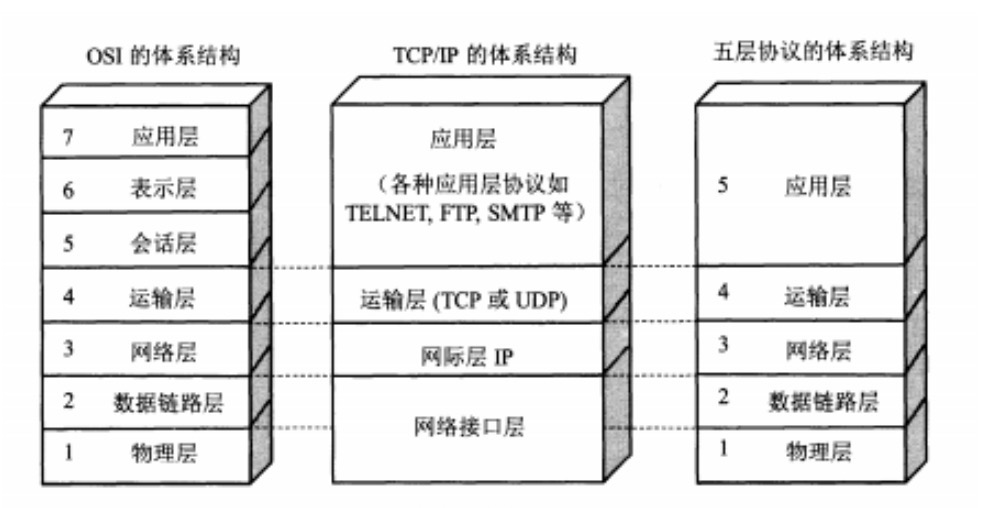
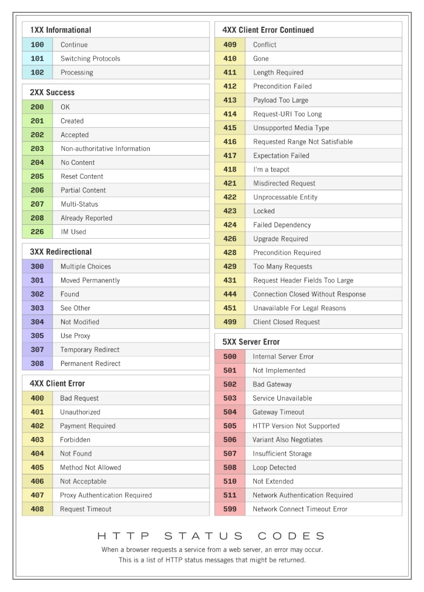
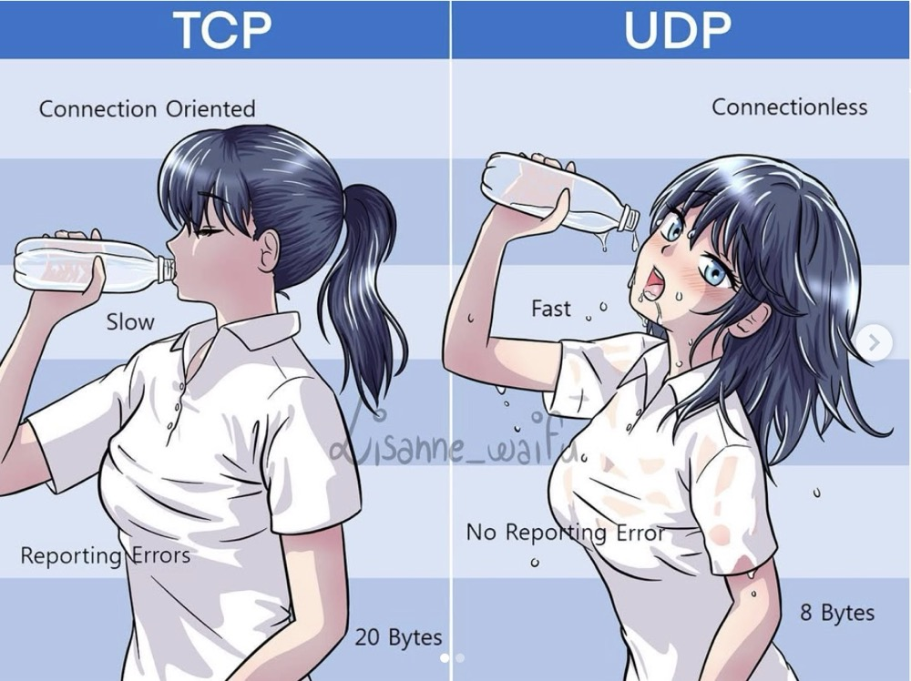

# Internet for kids
> 以下是一些常用的网络基础知识

## 前情提要
??? info "IPv4 & IPv6"
    IPv4

    - 由 4 个段组成，每个段 8 位，表示 32 位整数的方式 IPv4 地址
    
    IPv6 
    
    - [测一测你的 IPv6](https://test-ipv6.com/)
    - 由 8 个段组成，每个段 16 位，表示 128 位整数的方式 IPv6 地址
    - 连续全 0 段可以省略
    - 也有 IPv4-mapped IPv6 地址，用于兼容 IPv4 地址 `::ffff:10.78.18.216`
    - Linux 由 `ping6` 命令

    一台主机可以有多个 IP 地址
    
    - 例如一个局域网主机可能有多个局域网 IP 和 公网 IP
    - 一个主机有多个网卡，每个网卡可以有多个 IP 地址
    
??? info "网关和子网掩码"
    - 网关：将不同网络连接起来的设备
        - 连接局域网和互联网的路由器
        - 一般来说，局域网的主机的网关是路由器的 IP 地址
    - 子网：将一个大的网络分割成多个小的网络，每个小的网络称为一个子网
        - 子网掩码用于判断两个 IP 地址是否在同一个子网中
    - NAT：网络地址转换
        - 用于将局域网的多个主机的 IP 地址转换为一个公网 IP 地址
        - 通过修改 IP 数据包的源地址和目的地址来实习

??? info "端口"
    - 端口是**应用层**的东西
    - IP 地址识别机器，端口号识别软件
    - TCP 与 UDP 的端口是分开的，即同一个端口可以同时用于 TCP 和 UDP
    - 端口号的范围是 0 ~ 65535
        - 0 ~ 1023 是系统端口，不能被用户使用
        - 1024 ~ 49151 是注册端口，分配给用户使用
        - 49152 ~ 65535 是动态端口，分配给用户使用
    - 一般情况下，不同软件使用的端口号是不同的
        - 通过 `netstat -an | grep 80` 命令查看端口号 

??? info "域名"
    - 从右到左依次为二级、三级域名等：
        - 例如 `www.baidu.com`，`baidu.com` 是顶级域名，`com` 是二级域名，`www` 是三级域名
    - 拥有一个域名意味着拥有一个互联网上的身份
        - 可以设置任意多个子域名，如 `blog.example.com` 等 
    - 域名下面可以有任意多条 **DNS** 记录
        - DNS 服务商可以和域名注册商不同
        - 记录的类型有：
            - **A 记录**：将域名映射到为 IPv4 地址（最主要的功能）
            - **CNAME 记录**：将域名解析为另一个域名（别名）
            - MX 记录：将域名解析为邮件服务器的 IP 地址
            - TXT 记录：将域名解析为文本信息
            - NS 记录：将域名解析为 DNS 服务器的 IP 地址
        - 记录的 TTL 是记录的生存时间，单位是秒
            - 一般设置为 3600 秒，即 1 小时
            - 可以通过 `dig` 命令查看 DNS 记录的 TTL 值
            - 可以通过 `nslookup` 命令查看 DNS 记录的 TTL 值
## 从输入 URL 到页面展示展示发生了什么？
??? info "执行过程"
    - 浏览器先做 `URL 解析`，分为协议，域名，路径，端口号（默认http就是80）
    - 做 `DNS 解析`，浏览器先会查dns缓存有没有，没有问操作系统缓存，再没有就问本地的dns服务器，然后递归查询，返回给浏览器。
    - 浏览器获得ip地址后，`三次握手` 建立tcp连接。
    - 发送请求：浏览器通过 HTTP 或 HTTPS 协议，向目标网站的服务器发送 `http/https请求报文` ，询问它是否能提供所需的网页。
    - 网站的服务器接收到请求后，会处理并`返回网页内容`（HTML 文件、图片、样式等）。
    - 浏览器接收到网页内容后，会产生 DOM 树 和 CSSOM 树，结合产生 `渲染树` 进行解析和渲染，再执行 js
## TCP/IP 模型和 OSI 模型
??? info "5层模型"
    OSI 七层模型 |
    TCP/IP 四层模型 |
    在生产中我们一般考虑下列 5 层`应用层` `传输层` `网络层` `链接层` `物理层`
    
## HTTP 协议概述
请求报文和响应报文

请求方式

GET 和 POST 的区别

???info "常见请求状态码"
    
    
    - 1XX 信息：请求已接收，继续处理
    - 200 成功
    - 206 处理了一部分 Get 请求，比如视频的一部分（b 站的视频请求似乎是Range请求）
    - 301 永久重定向，请求资源资源被永久的移动到新 URI
    - 400 客户端的参数错误
    - 401 用户身份不对
    - 403 用户权限不足
    - 500 服务器内部错误
  
    [猫咪示意图](https://http.cat/)
    
强缓存和协商缓存

1.0 和 1.1 区别

2.0 和 1.1 区别

HTTPS 和 HTTP

HTTPS 加密过程

## TCP 和 UPD 协议概述
???warning "TCP&UDP [NSFW] "
    
TCP 连接确保可靠性

UDP 实现可靠传输

三次握手，四次挥手

TCP 的 Keep-Alive 和 HTTP 的 Keep-Alive

## 域名系统与 DNS
???info "CDN 是什么"
    1111

??? info "Cookie，Session 和 Token"
    - **`Session-Cookie` 认证机制：**
        在 Web 应用中，HTTP 的通信是 `无状态` 的，所以服务端无法分辨上一次的请求发送者和这一次的发送者是否是同一个
        人。那么这个状态可以通过 `Cookie` 来实现。

        1. **Cookie 的作用：**
            - Cookie 是存储在客户端的一小段数据，由服务端生成并通过 HTTP 响应头发送到浏览器。
            - 浏览器会在后续请求中自动携带 Cookie，用于标识用户或传递信息。

        2. **Session 的作用：**
            - Session 是`服务端`存储用户状态信息的机制，通常通过唯一的 `Session ID` 与客户端的 Cookie 绑定。
            - 当用户请求服务时，服务端根据 `Session ID` 来验证用户状态。

        3. **工作流程：**
            用户第一次访问服务，服务端创建一个 Session，并将 `Session ID` 写入用户的 Cookie。

            用户后续访问时，浏览器自动携带 Cookie，服务端通过 `Session ID` 验证用户身份。

        4. **优缺点和使用场景：**
           - 优点：Cookie 简单易用服务端控制用户状态，安全性高。
           - 缺点：需要服务端存储 Session 数据，可能造成性能瓶颈；依赖 Cookie，一旦用户在浏览器端禁用 Cookie，那么就 G 了；
           - 一般中大型网站都适用（除了 `APP 移动端`）。一般会使用 `Redis` 存储 Session 数据，所以预算不够的请慎重
    - **`Token` 认证机制：**
        Token 是一种更现代化的认证方式，通常使用 JSON Web Token（JWT）。

        1. **Token 的作用：**
            - 用户登录成功后，服务端生成一个 Token 并返回给客户端。
            - 客户端在后续请求中将 Token 添加到请求头中，用于身份验证。

        2. **Token 的特点：**
            - Token 是无状态的，不需要服务端存储会话数据。
            - 通常使用加密算法对 Token 进行签名，防止篡改。

        3. **工作流程：**
           用户登录时，服务端生成 Token，并返回给客户端。
           客户端存储 Token（例如在 `localStorage` 或 `sessionStorage`）。
           后续请求时，客户端在请求头中携带 Token，服务端验证 Token 的合法性。

        4. **优缺点：**
           - 优点：无状态、可扩展性强。
           - 缺点：Token 通常较大，可能导致带宽占用；失效的 Token 不能立即被服务端撤销。